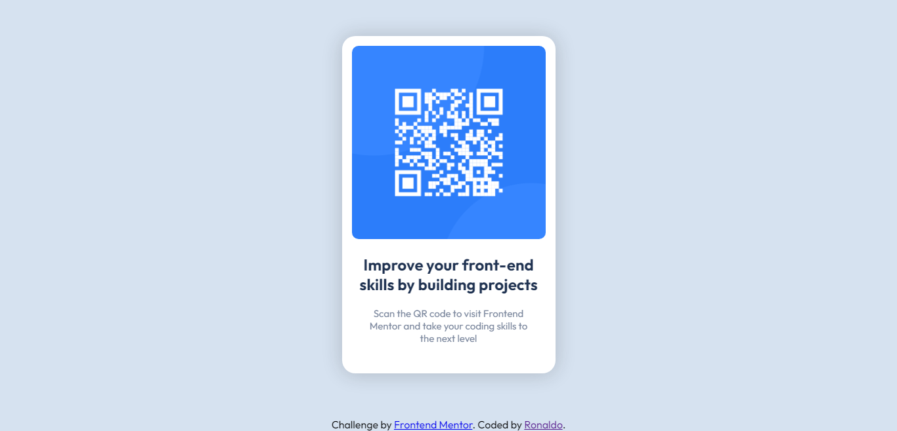

 

# Frontend Mentor - QR code component solution

This is a solution to the [QR code component challenge on Frontend Mentor](https://www.frontendmentor.io/challenges/qr-code-component-iux_sIO_H). Frontend Mentor challenges help you improve your coding skills by building realistic projects.

## Table of contents

- [Overview](#overview)
  - [Screenshot](#screenshot)
  - [Links](#links)
- [My process](#my-process)
  - [Built with](#built-with)
- [Author](#author)

## Overview

### Screenshot

### Links

- Solution URL: [https://github.com/marckesin/QR-code-component-challenge-hub](https://github.com/marckesin/QR-code-component-challenge-hub)
- Live Site URL: [marckesin.github.io/QR-code-component-challenge-hub/](https://marckesin.github.io/QR-code-component-challenge-hub/)

## My process

### Built with

- Semantic HTML5 markup
- CSS custom properties
- Flexbox
- CSS Grid
- Mobile-first workflow

## Author

- Frontend Mentor - [@marckesin](https://www.frontendmentor.io/profile/marckesin)
- Linkedin - [marckesin](https://linkedin.com/in/marckesin)
